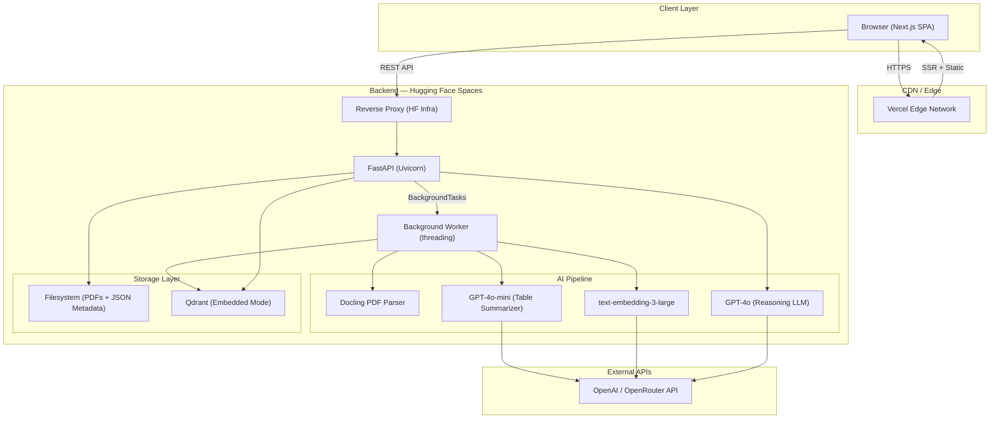
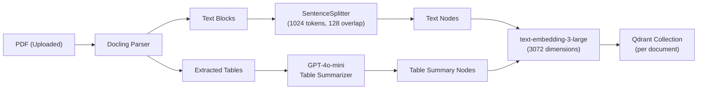
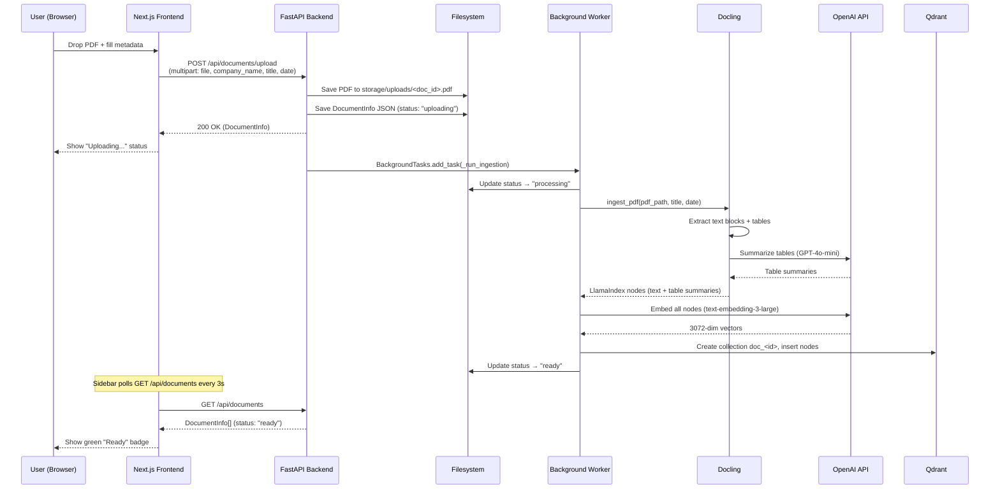
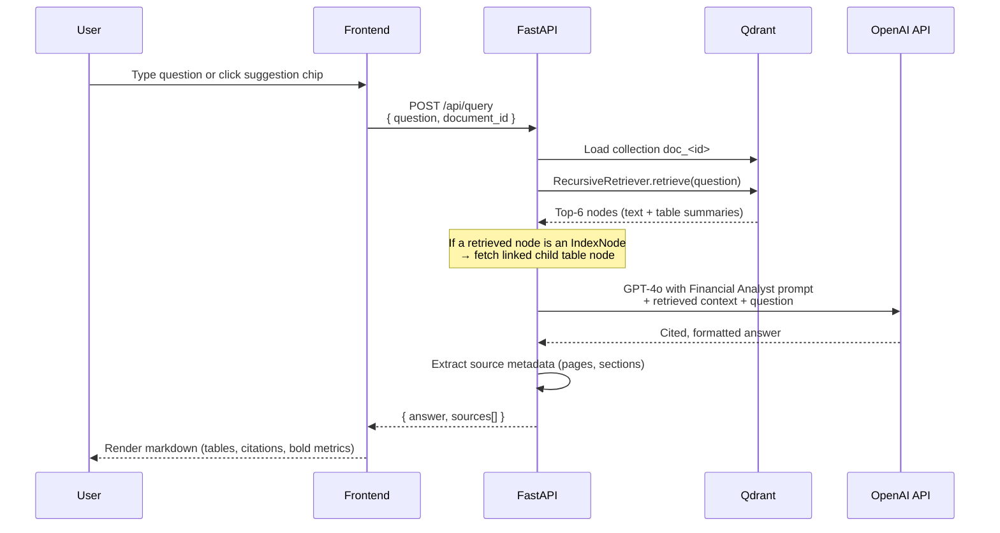
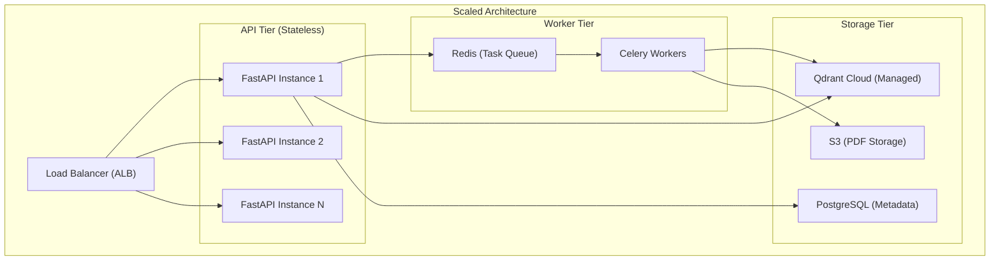
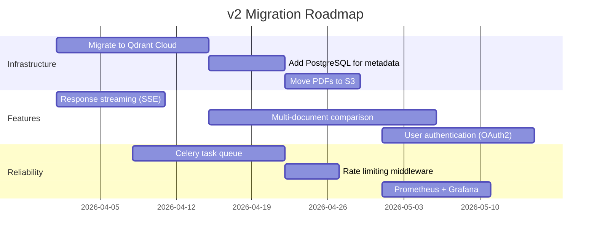

# System Design Document — Financial RAG Analyst

> **Project**: Financial RAG Analyst
> **Author**: Senior Staff Systems Architect
> **Date**: March 7, 2026
> **Version**: 1.0

---

## 1. Executive Summary

Financial RAG Analyst is a **Retrieval-Augmented Generation (RAG) platform** purpose-built for SEC filings and financial documents. Users upload 10-K, 10-Q, or annual reports as PDFs; the system ingests, chunks, embeds, and indexes them into per-document vector collections. A specialized financial analyst LLM prompt then answers user queries with **cited, numerically-formatted, tabular responses** grounded exclusively in the uploaded filing.

### Value Proposition

| Capability | Detail |
|---|---|
| **Multi-company support** | Any company's filing — no hardcoded entities |
| **Table-aware ingestion** | Docling extracts tables as structured data; GPT-4o-mini summarizes them for retrieval |
| **Unit-multiplier tagging** | Automatically detects "In millions" / "In thousands" and scales reported values |
| **Cited answers** | Every factual claim includes `(Page X)` references |
| **Guardrails** | Refuses to answer questions outside the filing's scope |

### Primary Users

- **Financial analysts** performing due diligence on SEC filings
- **Internal research teams** querying earnings data across multiple companies
- **Portfolio managers** seeking rapid, cited answers from annual reports

### Scale Requirements (Current Tier)

| Metric | Target |
|---|---|
| Concurrent users | ~50 |
| Ingestion throughput | 1 PDF at a time (background task) |
| Query latency (p95) | < 8 s (LLM-bound) |
| Uptime | 99.5% (Hugging Face Spaces free tier) |
| Storage | 16 GB ephemeral (HF Spaces) |

---

## 2. System Architecture

### 2.1 High-Level Overview



### 2.2 Component Breakdown

#### Frontend — Next.js 15 (App Router)

| Component | Responsibility |
|---|---|
| [page.tsx](file:///Users/sudarshanc/.gemini/antigravity/scratch/Financial_RAG/frontend/src/app/page.tsx) | Landing page, document list, upload CTA |
| [chat/[docId]/page.tsx](file:///Users/sudarshanc/.gemini/antigravity/scratch/Financial_RAG/frontend/src/app/chat/%5BdocId%5D/page.tsx) | Chat interface with suggestion chips, streaming display |
| [Sidebar.tsx](file:///Users/sudarshanc/.gemini/antigravity/scratch/Financial_RAG/frontend/src/components/Sidebar.tsx) | Document list with real-time status polling |
| [UploadModal.tsx](file:///Users/sudarshanc/.gemini/antigravity/scratch/Financial_RAG/frontend/src/components/UploadModal.tsx) | Drag-and-drop PDF upload with auto-detect company name |
| [ChatMessage.tsx](file:///Users/sudarshanc/.gemini/antigravity/scratch/Financial_RAG/frontend/src/components/ChatMessage.tsx) | Markdown-rendered bubbles with financial table styling |
| [api.ts](file:///Users/sudarshanc/.gemini/antigravity/scratch/Financial_RAG/frontend/src/lib/api.ts) | API client (`fetch`-based, typed) |
| [types.ts](file:///Users/sudarshanc/.gemini/antigravity/scratch/Financial_RAG/frontend/src/lib/types.ts) | TypeScript interfaces mirroring Pydantic models |

**Design decisions**:
- Vanilla CSS (no Tailwind) for full control over a dark glassmorphism theme with animated gradients.
- `react-dropzone` for accessible file upload.
- 3-second polling interval on the sidebar for document status updates during ingestion.

#### Backend — FastAPI + Uvicorn

| Module | Responsibility |
|---|---|
| [api.py](file:///Users/sudarshanc/.gemini/antigravity/scratch/Financial_RAG/api.py) | REST endpoints, CORS, background task orchestration |
| [ingest.py](file:///Users/sudarshanc/.gemini/antigravity/scratch/Financial_RAG/ingest.py) | PDF → nodes pipeline (Docling + LlamaIndex) |
| [indexer.py](file:///Users/sudarshanc/.gemini/antigravity/scratch/Financial_RAG/indexer.py) | Qdrant collection management, `RecursiveRetriever` builder |
| [query_engine.py](file:///Users/sudarshanc/.gemini/antigravity/scratch/Financial_RAG/query_engine.py) | Financial analyst prompt, `RetrieverQueryEngine` construction |
| [config.py](file:///Users/sudarshanc/.gemini/antigravity/scratch/Financial_RAG/config.py) | Centralized configuration (API keys, model names, parameters) |

#### Infrastructure

| Layer | Technology | Rationale |
|---|---|---|
| **Hosting (Backend)** | Hugging Face Spaces (Docker SDK) | 16 GB RAM for Docling + Qdrant in-process |
| **Hosting (Frontend)** | Vercel (Edge) | Zero-config Next.js deployment, global CDN |
| **Vector DB** | Qdrant (embedded/local mode) | No external service dependency; persists to filesystem |
| **LLM Provider** | OpenAI (GPT-4o / GPT-4o-mini) | Best-in-class financial reasoning; OpenRouter fallback |
| **Embeddings** | `text-embedding-3-large` (3072-dim) | Highest fidelity for financial terminology |
| **PDF Parser** | Docling 2.x | Superior table extraction vs. LlamaParse for SEC filings |
| **Container** | Python 3.11-slim + system libs | Minimal image; `libpoppler`, `libgl1` for PDF/CV processing |

---

## 3. Data Modeling

### 3.1 Document Metadata (JSON on Filesystem)

Each document is assigned a UUID (`doc_id`) at upload. Metadata is persisted as a JSON file:

```
storage/
├── documents/
│   ├── <doc_id>.json        ← DocumentInfo metadata
│   └── ...
├── uploads/
│   ├── <doc_id>.pdf         ← Original uploaded PDF
│   └── ...
└── qdrant/
    └── collection_doc_<id>/ ← Per-document Qdrant collection
```

**Schema — `DocumentInfo` (Pydantic Model)**:

```python
class DocumentInfo(BaseModel):
    id: str                    # UUID4
    filename: str              # Original filename
    company_name: str          # User-provided or auto-detected
    document_title: str        # e.g., "10-K Annual Report"
    document_date: str         # e.g., "Fiscal Year 2025"
    status: str                # "uploading" | "processing" | "ready" | "error"
    created_at: str            # ISO 8601 timestamp
    file_size: int = 0         # Bytes
    error_message: str = ""    # Populated on ingestion failure
```

**Why JSON on Filesystem (not a RDBMS)?**
- **Simplicity**: ≤100 documents per deployment; no joins or complex queries needed.
- **Atomicity**: Each document is an independent JSON file — no table-level locks.
- **Portability**: Entire state can be `tar`-ed and moved between environments.
- **Trade-off**: No ACID transactions across documents. Acceptable at current scale.

### 3.2 Vector Index (Qdrant)

Each uploaded document produces its own Qdrant collection named `doc_<uuid_underscored>`.

**Node Types in Each Collection**:

| Node Type | Source | Metadata Fields |
|---|---|---|
| **Text Chunk** | Docling text extraction → LlamaIndex `SentenceSplitter` | `page_label`, `section_title`, `multiplier` |
| **Table Summary** | Docling table extraction → GPT-4o-mini summary | `page_label`, `section_title`, `is_table: true`, `multiplier`, `original_table` |
| **Index Node** | LlamaIndex `IndexNode` pointing at table summaries | Links to child table node for recursive retrieval |

**Why Qdrant Embedded Mode?**
- **Zero network hops**: Vector search runs in-process (~5–15 ms per query).
- **Persistence**: Collections are saved to `./storage/qdrant/` and survive container restarts.
- **Trade-off**: Not horizontally scalable. Single-node only. Acceptable for <100 collections.

### 3.3 Embedding Strategy



**Chunking Parameters**:
- `CHUNK_SIZE = 1024` tokens — balances context window with retrieval precision.
- `CHUNK_OVERLAP = 128` tokens — prevents information loss at chunk boundaries.
- `SIMILARITY_TOP_K = 6` — retrieves top 6 most relevant chunks per query.

---

## 4. Component Interaction

### 4.1 Upload & Ingestion Flow



### 4.2 Query Flow



### 4.3 Financial Analyst Prompt Pipeline

The query engine applies a **strict rule-based prompt** injected with dynamic document metadata:

```
┌─────────────────────────────────────────────────────┐
│ FINANCIAL ANALYST PROMPT                            │
│                                                     │
│ Dynamic Params:                                     │
│   • {document_title} → e.g., "Apple 10-K FY2025"   │
│   • {document_date}  → e.g., "Fiscal Year 2025"    │
│                                                     │
│ Rules:                                              │
│   1. Numerical Formatting (multiplier-aware)        │
│   2. Comparison Engine (YoY % change formula)       │
│   3. Citations (Page X) on every claim              │
│   4. Structured Tables (>2 data points → table)     │
│   5. Guardrails (refuse out-of-scope)               │
│   6. Context Verification (state what's missing)    │
│                                                     │
│ Context: {{context_str}}  ← from Qdrant retrieval   │
│ Question: {{query_str}}   ← from user               │
└─────────────────────────────────────────────────────┘
```

---

## 5. Scalability & Reliability

### 5.1 Current Architecture Constraints

| Bottleneck | Impact | Mitigation |
|---|---|---|
| **Single-threaded ingestion** | Only 1 PDF processes at a time | FastAPI `BackgroundTasks` uses threading; acceptable at <50 users |
| **Qdrant embedded mode** | Single-node, not clusterable | Migrate to Qdrant Cloud when >100 collections |
| **Ephemeral storage (HF Spaces)** | Data lost on Space restart | Accept for MVP; migrate to persistent volumes |
| **LLM latency (GPT-4o)** | 3–8 s per query | Non-negotiable for quality; can add streaming |
| **No rate limiting** | Vulnerable to abuse | Add middleware rate limiter in v2 |

### 5.2 Horizontal Scaling Strategy (v2)



### 5.3 Failover & Resilience

| Strategy | Implementation |
|---|---|
| **Health checks** | `GET /api/health` returns API key status + system info |
| **Graceful degradation** | If Qdrant collection missing → return 404, not 500 |
| **Error isolation** | Ingestion failures set `status: "error"` with `error_message` — never crash the API |
| **CORS security** | Regex-based origin allowlist: `*.vercel.app`, `*.hf.space`, localhost |
| **Idempotent uploads** | Each upload gets a fresh UUID — no collision risk |

### 5.4 Observability

| Signal | Current | Target (v2) |
|---|---|---|
| **Logging** | Python `logging` to stdout | Structured JSON → Datadog/Grafana |
| **Metrics** | None | Prometheus (request latency, ingestion duration, query count) |
| **Tracing** | Node-level debug logs in `format_response()` | OpenTelemetry spans across ingestion pipeline |
| **Alerting** | None | PagerDuty on ingestion failure rate > 10% |

---

## 6. Security Considerations

| Concern | Current State | Recommendation |
|---|---|---|
| **API Authentication** | None (open endpoints) | Add JWT or API key auth |
| **File Validation** | Accepts only `.pdf` (frontend + backend) | Add file size limits, virus scanning |
| **Secret Management** | `OPENAI_API_KEY` in HF Secrets | Rotate keys; use vault in production |
| **Data Privacy** | PDFs stored on ephemeral disk | Encrypt at rest; add retention policies |
| **Input Sanitization** | Form values passed directly | Validate/sanitize `company_name`, `document_title` |

---

## 7. Future Considerations

### 7.1 Technical Debt

| Item | Risk | Resolution |
|---|---|---|
| **JSON metadata on filesystem** | Data loss on container restart | Migrate to PostgreSQL or SQLite |
| **Synchronous query endpoint** | Blocks Uvicorn worker during LLM call | Add response streaming (SSE) |
| **No authentication** | Anyone can upload/delete/query | Add OAuth2 or API key middleware |
| **Hardcoded model names** | Model deprecation breaks system | Make models configurable via env vars |
| **No test suite** | Regressions go undetected | Add pytest for API + ingestion pipeline |

### 7.2 v2 Migration Roadmap



### 7.3 Feature Extensions

| Feature | Description | Complexity |
|---|---|---|
| **Multi-document queries** | "Compare Apple and Nvidia revenue" across separate filings | High — requires cross-collection retrieval |
| **Streaming responses** | Server-Sent Events for real-time token display | Medium — LlamaIndex supports streaming |
| **PDF annotation** | Highlight exact source passages in the original PDF | High — requires PDF.js + coordinate mapping |
| **Batch upload** | Upload multiple filings at once (parallel ingestion) | Medium — Celery + concurrent workers |
| **Fine-tuned embeddings** | Domain-specific embedding model for financial terminology | High — requires training data + evaluation |

---

## 8. Appendix

### A. API Endpoint Reference

| Method | Path | Description | Auth |
|---|---|---|---|
| `GET` | `/api/health` | Health check + API key status | None |
| `GET` | `/api/documents` | List all documents | None |
| `GET` | `/api/documents/{doc_id}` | Get document details | None |
| `POST` | `/api/documents/upload` | Upload PDF (multipart form) | None |
| `DELETE` | `/api/documents/{doc_id}` | Delete document + index | None |
| `POST` | `/api/query` | Query a document | None |

### B. Environment Variables

| Variable | Required | Description |
|---|---|---|
| `OPENAI_API_KEY` | ✅ | OpenAI or OpenRouter API key |
| `PORT` | ❌ | Server port (default: 7860 for HF, 8000 for local) |
| `NEXT_PUBLIC_API_URL` | ✅ | Backend API URL for frontend |

### C. Technology Versions

| Technology | Version |
|---|---|
| Python | 3.11 |
| FastAPI | Latest (via pip) |
| LlamaIndex | ≥ 0.12.0 |
| Qdrant Client | ≥ 1.12.0 |
| Docling | ≥ 2.0.0 |
| Next.js | 15.x |
| Node.js | 22.x |
| GPT-4o | Latest |
| text-embedding-3-large | 3072 dimensions |
